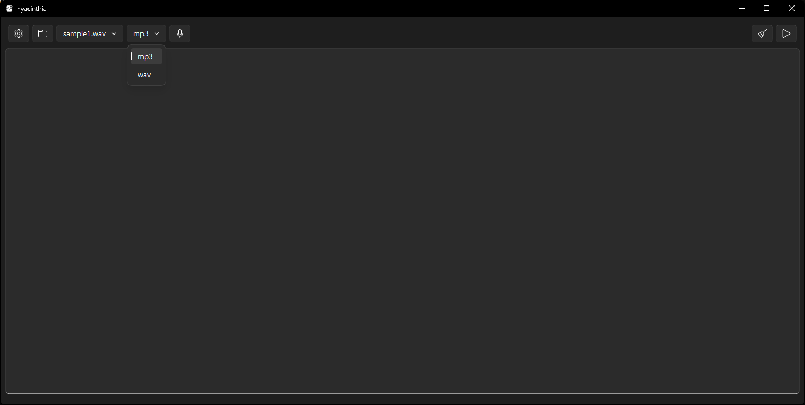
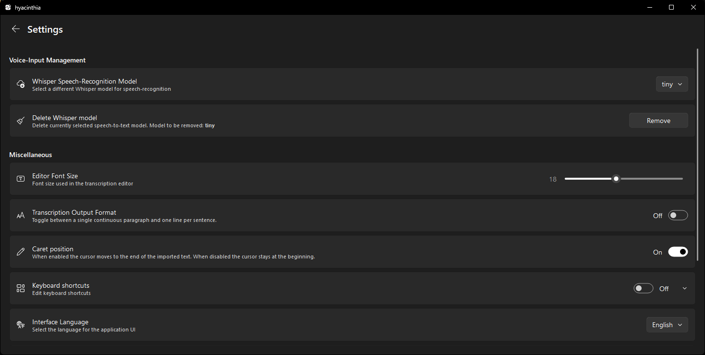
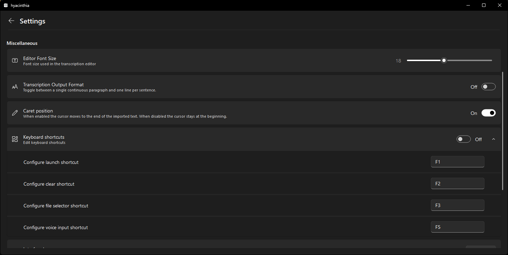

**hyacinthia** is a simple graphical front‑end for F5‑TTS. It was developed specifically for a family member, and as such, it is provided as-is.

## License

**hyacinthia** is licensed under the [GNU GPL version 3](./LICENSE).  
You are free to use, modify, and distribute it under the terms of the GNU GPL version 3 (or later).

This software depends on packages that may be licensed under different open-source or proprietary licenses. Their license texts are provided in the [licenses/](./licenses) directory.

## Screenshots

**Main Window**  
  

**Settings**  
  

  

### Prerequisites

1. [Python 3.12](https://www.python.org/downloads/release/python-3129/)
2. [Git](https://git-scm.com/downloads)
3. Windows
4. NVIDIA GPU with CUDA 12.6 support 

### Installation

1. Clone the repository:
   ```bash
   git clone https://github.com/icosane/hyacinthia.git
   ```
2. Navigate to the folder and create a virtual environment:
   ```bash
   python -m venv .
   ```
3. Activate the virtual environment:
   ```bash
   .\Scripts\activate
   ```
4. Install requirements:
   ```bash
   pip install -r requirements.txt
   ```
5. Download [ ffmpeg-2026-01-05-git-2892815c45-full_build.7z ](https://github.com/GyanD/codexffmpeg/releases/tag/2026-01-05-git-2892815c45) and place the bin folder into:
   ```
   ./files/models/ffmpeg/
   ```

6. Download `config.yaml` and `pytorch_model.bin` from [vocos-mel-24khz](https://huggingface.co/charactr/vocos-mel-24khz/tree/main) and place them into:
   ```
   ./files/models/vocoder/
   ```
7. Download any F5-TTS model (specifically `.safetensors` and `vocab.txt`) and place into:
    ```
   ./files/models/tts/
   ```
    Tested on: [F5-TTS_RUSSIAN](https://huggingface.co/Misha24-10/F5-TTS_RUSSIAN)
8. Download [omogre](https://huggingface.co/omogr/omogre). You need `accentuator_transcriptor_tiny.gz`. Place the unarchived files into:
    ```
   ./files/models/omogre/
   ```

   **Tip:** You can also open the folder in [Visual Studio Code](https://code.visualstudio.com/download) or [VSCodium](https://github.com/VSCodium/vscodium/releases), install the Python extension, then press `Ctrl+Shift+P` → **Python: Create Environment** → `.venv` → select `requirements.txt`.

## Voice input

Select your preferred Whisper model in **Settings** — options include `tiny`, `base`, `small`, `medium`, `large-v1`, `large-v2`, `large-v3`, `large`, and `large-v3-turbo`. 

`.en` models are hidden (English-only), and distil models are excluded due to performance issues during testing.

Downloaded models are stored in: `files/models/whisper`.

## Registry entries
The application stores some settings in the system registry. To clear these settings, simply delete the following registry key:
```
HKEY_CURRENT_USER\Software\icosane\hyacinthia
```

## Acknowledgments
- [text to speech icons](https://www.flaticon.com/free-icons/text-to-speech) by FACH - Flaticon
- [Russian Accentuator and IPA Transcriptor](https://huggingface.co/omogr/omogre) by omogr
- [F5-TTS_RUSSIAN](https://huggingface.co/Misha24-10/F5-TTS_RUSSIAN) by Misha24-10
- [Minimal example of f5_tts inference](https://github.com/saionaro/f5_tts_infer_min) by saionaro